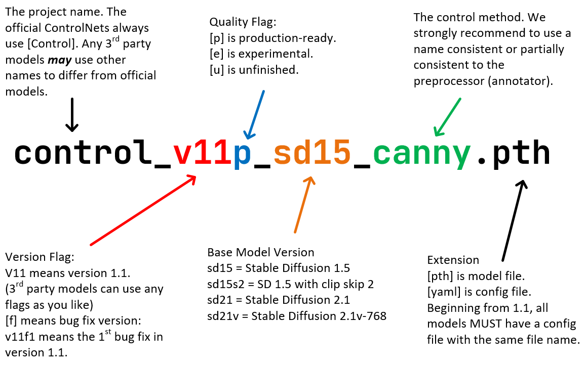
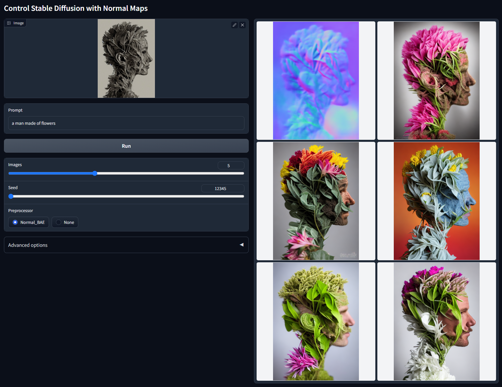
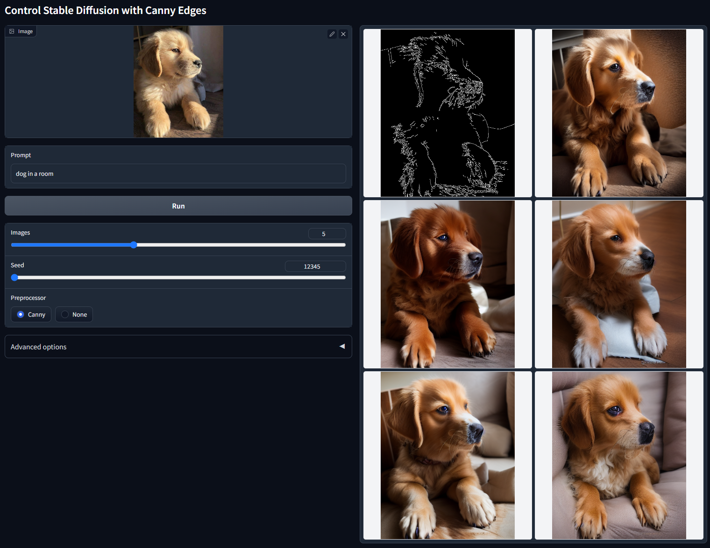
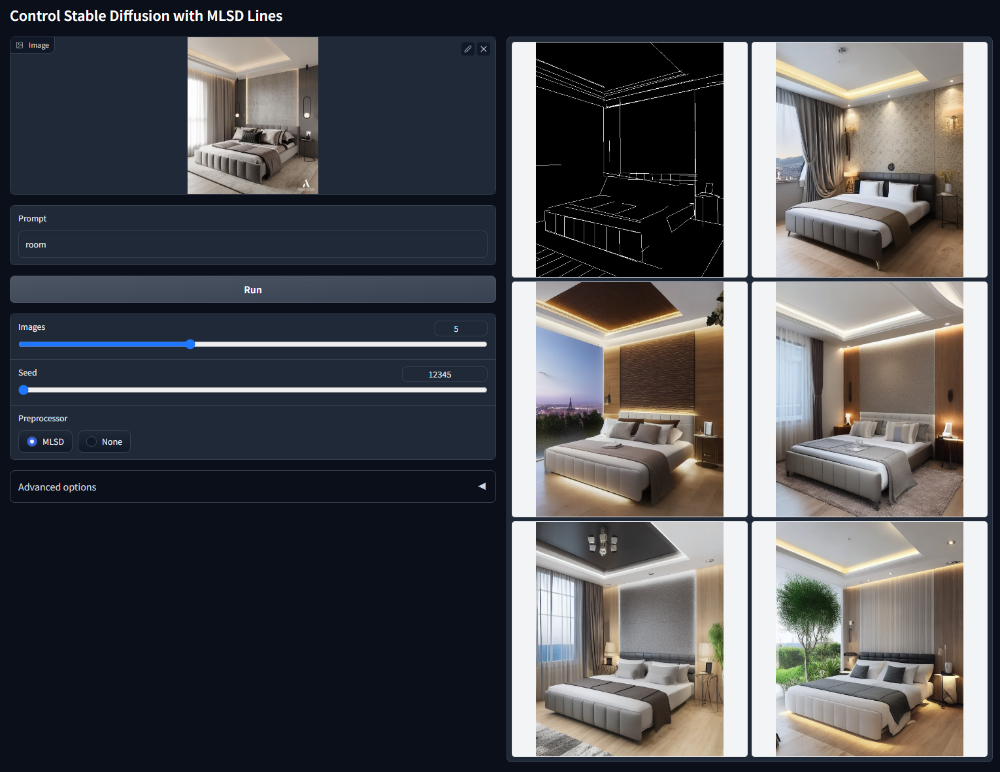

# ControlNet 1.1

This is the official release of ControlNet 1.1.

ControlNet 1.1 has the exactly same architecture with ControlNet 1.0. 

We promise that we will not change the neural network architecture before ControlNet 1.5 (at least, and hopefully we will never change the network architecture). Perhaps this is the best news in ControlNet 1.1.

ControlNet 1.1 includes all previous models with improved robustness and result quality. Several new models are added.

# Model Specification

Starting from ControlNet 1.1, we begin to use the Standard ControlNet Naming Rules (SCNNRs) to name all models. We hope that this naming rule can improve the user experience.

ControlNet 1.1 include 14 models (11 production-ready models, 2 experimental models, and 1 unfinished model):

    control_v11p_sd15_canny
    control_v11p_sd15_mlsd
    control_v11p_sd15_depth
    control_v11p_sd15_normalbae
    control_v11p_sd15_seg
    control_v11p_sd15_inpaint
    control_v11p_sd15_lineart
    control_v11p_sd15s2_lineart_anime
    control_v11p_sd15_openpose
    control_v11p_sd15_scribble
    control_v11p_sd15_softedge
    control_v11e_sd15_shuffle
    control_v11e_sd15_ip2p
    control_v11u_sd15_tile

You can download all those models from our [HuggingFace Model Page](https://huggingface.co/lllyasviel/ControlNet-v1-1/tree/main). All these models should be put in the folder "models".

You need to download Stable Diffusion 1.5 model ["v1-5-pruned.ckpt"](https://huggingface.co/runwayml/stable-diffusion-v1-5/tree/main) and put it in the folder "models".

Our python codes will automatically download other annotator models like HED and OpenPose. Nevertheless, if you want to manually download these, you can download all other annotator models from [here](https://huggingface.co/lllyasviel/Annotators/tree/main). All these models should be put in folder "annotator/ckpts". 

To install:

    conda env create -f environment.yaml
    conda activate control-v11

## ControlNet 1.1 Depth

Control Stable Diffusion with Depth Maps.

Model file: control_v11p_sd15_depth.pth

Config file: control_v11p_sd15_depth.yaml

Training data: Midas depth (resolution 256/384/512) + Leres Depth (resolution 256/384/512) + Zoe Depth (resolution 256/384/512). Multiple depth map generator at multiple resolution as data augmentation.

Acceptable Preprocessors: Depth_Midas, Depth_Leres, Depth_Zoe. This model is highly robust and can work on real depth map from rendering engines.

    python gradio_depth.py

Non-cherry-picked batch test with random seed 12345 ("a handsome man"):

## ControlNet 1.1 Normal

Control Stable Diffusion with Normal Maps.

Model file: control_v11p_sd15_normalbae.pth

Config file: control_v11p_sd15_normalbae.yaml

Training data: [Bae's](https://github.com/baegwangbin/surface_normal_uncertainty) normalmap estimation method.

Acceptable Preprocessors: Normal BAE. This model can accept normal maps from rendering engines as long as the normal map follows [ScanNet's](http://www.scan-net.org/) protocol. That is to say, the color of your normal map should look like [the second column of this image](https://raw.githubusercontent.com/baegwangbin/surface_normal_uncertainty/main/figs/readme_scannet.png).

Note that this method is much more reasonable than the normal-from-midas method in ControlNet 1.1. The previous method will be abandoned.

    python gradio_normalbae.py

Non-cherry-picked batch test with random seed 12345 ("a man made of flowers"):

Non-cherry-picked batch test with random seed 12345 ("room"):

## ControlNet 1.1 Canny

Control Stable Diffusion with Canny Maps.

Model file: control_v11p_sd15_canny.pth

Config file: control_v11p_sd15_canny.yaml

Training data: Canny with random thresholds.

Acceptable Preprocessors: Canny.

We fixed several problems in previous training datasets. The model is resumed from ControlNet 1.0 and trained with 200 GPU hours of A100 80G.

    python gradio_canny.py

Non-cherry-picked batch test with random seed 12345 ("dog in a room"):

## ControlNet 1.1 MLSD

Control Stable Diffusion with M-LSD straight lines.

Model file: control_v11p_sd15_mlsd.pth

Config file: control_v11p_sd15_mlsd.yaml

Training data: M-LSD Lines.

Acceptable Preprocessors: MLSD.

We fixed several problems in previous training datasets. The model is resumed from ControlNet 1.0 and trained with 200 GPU hours of A100 80G.

    python gradio_mlsd.py

Non-cherry-picked batch test with random seed 12345 ("room"):

## ControlNet 1.1 Scribble

Control Stable Diffusion with Scribbles.

Model file: control_v11p_sd15_scribble.pth

Config file: control_v11p_sd15_scribble.yaml

Training data: Synthesized scribbles.

Acceptable Preprocessors: Synthesized scribbles (Scribble_HED, Scribble_PIDI, etc.) or hand-drawn scribbles.

We fixed several problems in previous training datasets. The model is resumed from ControlNet 1.0 and trained with 200 GPU hours of A100 80G.

    # To test synthesized scribbles
    python gradio_scribble.py
    # To test hand-drawn scribbles in an interactive demo
    python gradio_interactive.py

Non-cherry-picked batch test with random seed 12345 ("man in library"):

Non-cherry-picked batch test with random seed 12345 (interactive, "the beautiful landscape"):

